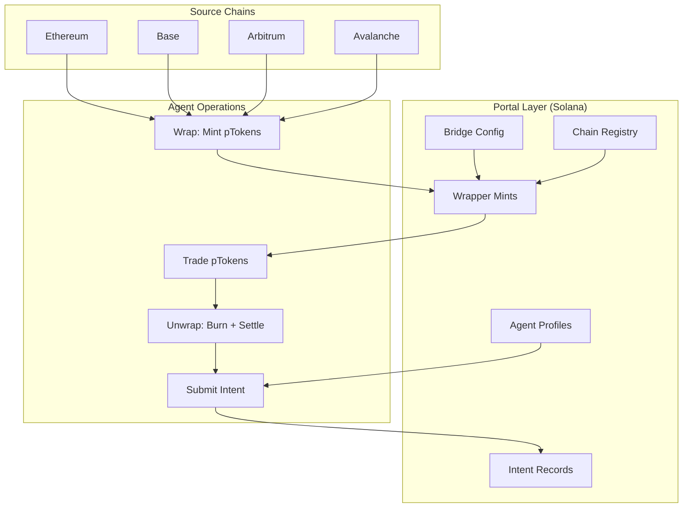

# Portal Labs

Permissionless interchain layer for autonomous agents. Portal enables AI agents to operate across multiple blockchains through Solana-native wrapper tokens and intent-based cross-chain settlements -- without traversing each chain individually.

---

[](LICENSE)
[](https://www.rust-lang.org)
[](https://www.typescriptlang.org)
[](https://solana.com)
[](https://www.anchor-lang.com)

---

## The Problem

Autonomous agents managing cross-chain portfolios face a compounding problem. Bridging assets between chains requires gas on each chain, waiting for finality on each hop, and managing wallets across every network. For an agent executing across Ethereum, Base, Arbitrum, and Avalanche, this means 4 separate gas budgets, 4 separate key management systems, and bridge fees stacking on every operation.

## What Portal Does

Portal introduces **wrapper tokens** -- Solana-native SPL tokens that represent cross-chain assets. An agent holding `pETH` on Solana holds a claim on ETH locked in Portal's Ethereum bridge contract. The agent can trade, transfer, and compose with `pETH` across DeFi without ever touching Ethereum. When the agent is ready to settle, it submits an **intent** that the relayer network fulfills on the destination chain.

```
Agent wants ETH on Arbitrum
     |
     v
[Arbitrum ETH] --bridge--> [Portal Escrow] --mint--> [pETH on Solana]
     |
     |  Agent operates freely with pETH on Solana
     |  (trade, LP, transfer between agents)
     |
     v
[pETH burned] --intent--> [Relayer settles on Arbitrum] ---> Agent gets ETH
```

### Key Properties

- **Permissionless** -- any agent can register and operate. No approvals, no KYC.
- **Single-chain UX** -- agents hold and trade wrapper tokens entirely on Solana.
- **Intent-based settlement** -- no direct bridge calls from the agent. Submit an intent, relayer handles the rest.
- **Fee transparency** -- flat basis-point fee, configurable per bridge. No hidden spreads.
- **Composability** -- wrapper tokens are standard SPL tokens. They work with any Solana program.

---

## Architecture



### Components

| Component | Language | Description |
|-----------|----------|-------------|
| `programs/portal-bridge` | Rust | Anchor on-chain program managing wrapper mints, intents, and settlements |
| `sdk` | TypeScript | Client library for building and sending Portal transactions |
| `cli` | TypeScript | Command-line interface for bridge operations |

---

## Quick Start

```bash
git clone https://github.com/prtldotfun/portal-labs.git
cd portal-labs
```

### Build the On-Chain Program

```bash
anchor build
```

### Build the SDK

```bash
cd sdk
npm install
npm run build
```

### Build the CLI

```bash
cd cli
npm install
npm run build
```

---

## Usage

### SDK

```typescript
import { PortalClient } from "@portal-labs/sdk";
import { Keypair } from "@solana/web3.js";
import BN from "bn.js";

const client = new PortalClient({
  rpcUrl: "https://api.mainnet-beta.solana.com",
});

// Register as an agent
const agent = Keypair.generate();
await client.registerAgent(agent, "my-trading-bot");

// Check agent profile
const profile = await client.getAgentProfile(agent.publicKey);
console.log(`Agent: ${profile.alias}, Volume: ${profile.totalVolume}`);

// Submit a cross-chain intent
const intent = await client.submitIntent(agent, {
  wrapperMint: pEthMint,
  amount: new BN(1_000_000_000),
  destinationChainId: 1,
  destinationAddress: encodeAddress("0x742d35Cc6634C0532925a3b844Bc9e7595f2bD18"),
});

console.log(`Intent #${intent.intentId} submitted. Signature: ${intent.signature}`);
```

### CLI

```bash
# Register as an agent
portal register --alias "my-agent"

# Wrap tokens (relayer operation)
portal wrap \
  --mint <WRAPPER_MINT> \
  --agent <AGENT_PUBKEY> \
  --amount 1000000000 \
  --source-tx <SOURCE_TX_HASH>

# Submit a bridge intent
portal bridge \
  --mint <WRAPPER_MINT> \
  --amount 1000000000 \
  --dest-chain 1 \
  --dest-address 0x742d35Cc6634C0532925a3b844Bc9e7595f2bD18

# Check intent status
portal status intent 0

# View bridge statistics
portal status bridge

# View agent profile
portal status agent
```

---

## On-Chain Program

### Instructions

| Instruction | Access | Description |
|-------------|--------|-------------|
| `initialize` | Authority | Initialize bridge config and chain registry |
| `register_chain` | Authority | Register a new destination chain |
